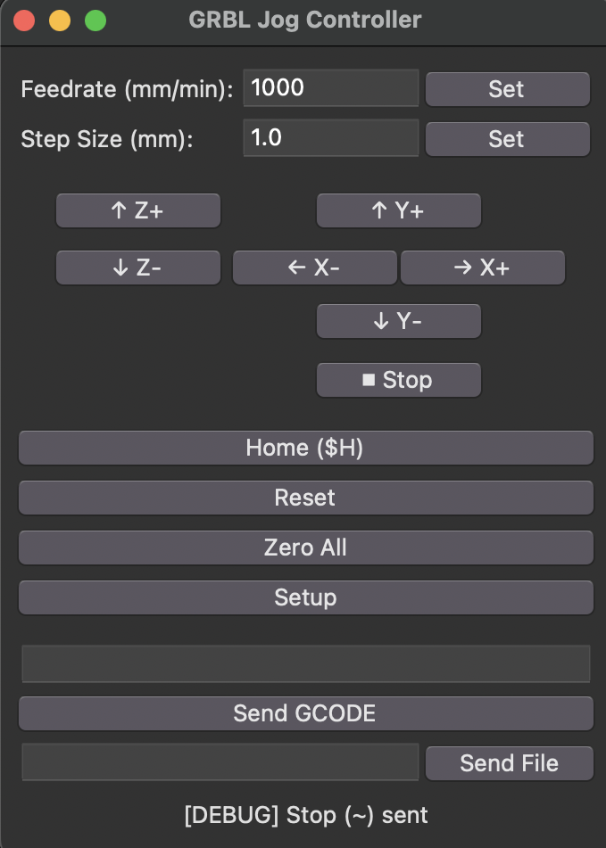

# Paint CNC

Paint CNC is a Raspberry Pi-based CNC painting machine that sends G-code to an Arduino running GRBL. It combines image processing, stepper control, and drawing input to turn digital art into physical paint.

---

## Project Structure

There are **three main components** of the codebase:

<details>
<summary> <strong>1. CNC Control - <code>jog.py</code></strong></summary>

`jog.py` provides a graphical interface to manually control the CNC machine.

- Jog in X, Y, Z directions.
- Control feedrate and step size.
- Send raw G-code or load files.
- Reset, home, and zero the machine.
- Dispense paint via the syringe.

**Dependencies:**
- `gcode_sender.py`: Handles G-code communication.
- `syringe_stepper.py`: Controls paint dispensing motor.

#### 🔧 Jog Control GUI:


</details>

---

<details>
<summary> <strong>2. Image Processing - <code>image_processing.py</code></strong></summary>

This script takes an image file and converts it into a G-code painting path.

### Features:
- Convert image to matrix/grid.
- Generate line-by-line paint G-code.
- Tuneable resolution and thresholds.

### 🔬 In Progress:
We are currently working on a new version that:
- Detects **border features** (edges, outlines).
- Produces expressive line art instead of raw pixel fill.
- Reduces redundant toolpaths for cleaner results.

</details>

---

<details>
<summary> <strong>3. Paint Drawing GUI - <code>paint_gui.py</code></strong></summary>

A simple GUI that allows users to draw their own artwork and convert it to G-code.

### Features:
- Freehand paint-style drawing.
- Adjustable brush size.
- Export to G-code for painting.

####  Paint GUI Example:


</details>

---

##  File Structure (Example)

```plaintext
project/
├── jog.py
├── paint_gui.py
├── image_processing.py
├── gcode_sender.py
├── syringe_stepper.py
├── jog_gui.jpg
├── painting_gui.jpg
└── README.md
